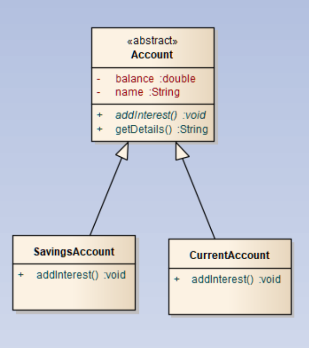

## Chapter 11: Inheritance and Abstraction
### The Aims
We all know that you cannot simply walk into a bank and open an ‘account’. It has to be a particular ‘type’ of account. We are going to modify our classes so that we have a number of subclasses of the Account class, and we will be instantiating them, and we will exploit polymorphism to manipulate our account objects. We ultimately want to change the addInterest method so that it works differently for each type of account object.

Finally, if you have time, you will make the Account class abstract, so it can no longer be instantiated.

project.
### Part 1: Create a new Eclipse Project
1.	Close all open files in Eclipse using File / Close All.
2.	Create a new Java Project called Inheritance.
3.	Using the Package Explorer, expand your first project and select the Account.java class and while holding down the control key, drag it into the src folder of the new Inheritance project.
4.	From the Inheritance project, open the Account class.

Note that all work from now on in this exercise will be completed in this project.

### Part 2: Defining the Subclasses
We will firstly define two subclasses of our class called Account. One will be SavingsAccount, and one will be CurrentAccount.

1.	Define a new class called SavingsAccount that extends Account. You can either add the ‘extends Account’ text in the editor, or in the New Class dialog box.
2.	Define a constructor that takes two arguments for name and balance. Why does this need to be here if there is one already defined in the superclass?
3.	In the constructor you have defined, pass the two parameters to the superclass constructor using the super keyword.
4.	Define a second class called CurrentAccount, and repeat steps 2 and 3 above.
5.	Now empty the contents of the addInterest method in the Account class. If you have time you will make it abstract later on. It should now look like this;

```public void addInterest() {```
}

6.	Now, in your two subclasses, override the addInterest method. Use the @Override annotation. 
7.	Multiply the balance by 1.1 in the current account and multiply the balance by 1.4 in the savings account. Remember, the balance property is private in the superclass, so can only be accessed directly by the superclass. This means that in your addInterest methods, you will have to use get and set methods to access the balance variable. See below;

// add interest method from the subclass SavingsAccount
@Override
public void addInterest() {
	setBalance(getBalance() *  1.1);
}

### Part 3: Instantiating our classes
1.	Define a new class with a main method called TestInheritance.
2.	Within the main method declare an array called accounts of type Account, and initialise it with 3 elements. One should be an Account object, one should be a SavingsAccount object, and one should be a CurrentAccount object. You do not need a loop for this bit.

These objects should have balances of 2, 4, and 6 respectively. The names can be whatever you like. 

How can we get away with placing one of each of these types in the same array? – Polymorphism!

3.	Now loop through the array, and call addInterest on each of the elements. Which addInterest will be called? There are three in total. One in each of the subclasses, and one in Account.
4.	To prove that polymorphism has worked, within the loop display the names and balances. They should have changed by the appropriate amount.

### Part 4: Abstract classes
Currently it is possible to instantiate Account, even though it is an abstract concept like mammal is in the animal world. We will finally make it impossible to instantiate Account, but maintain our inheritance hierarchy. We will make the Account class abstract.

1.	Modify the Account class declaration to include the abstract keyword.
2.	Modify the addInterest method and make it abstract. Don’t forget the semi-colon.
14.	You will now have an error in main because you are trying to instantiate an abstract class called Account.
15.	Modify the code inside main so that it now creates two SavingsAccounts and one CurrentAccount.
16.	Run your code. It should work as before. You have an array where the array type is abstract, and it contains objects of the various subclass types.
2.	Modify the addInterest method and make it abstract. Don’t forget the semi-colon.
14.	You will now have an error in main because you are trying to instantiate an abstract class called Account.
15.	Modify the code inside main so that it now creates two SavingsAccounts and one CurrentAccount.
16.	Run your code. It should work as before. You have an array where the array type is abstract, and it contains objects of the various subclass types.

 

 
 
