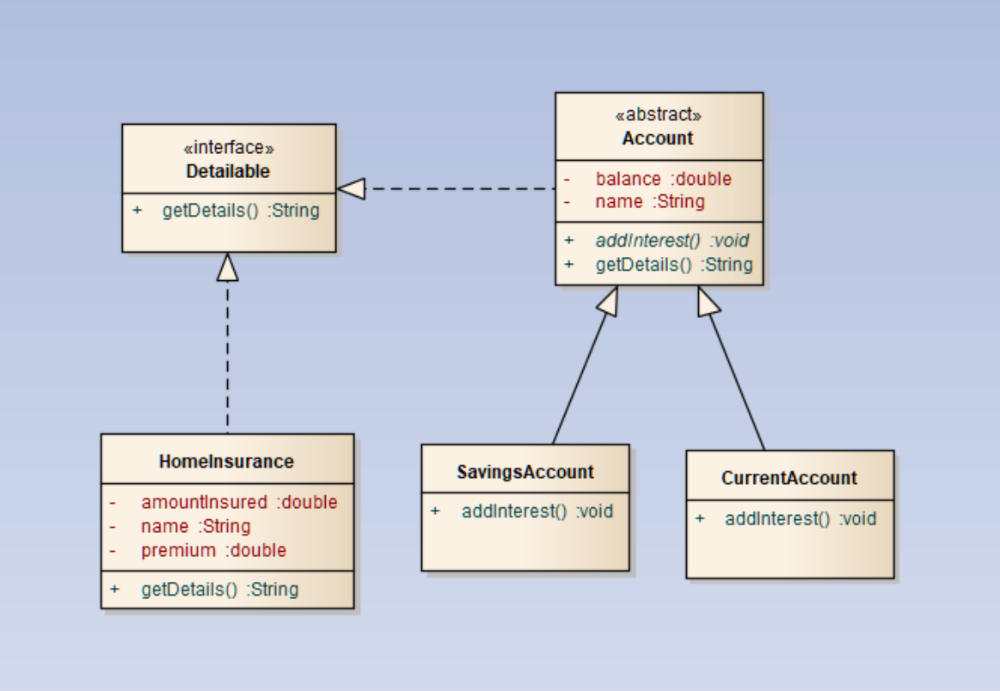

## Chapter 12: Interfaces
### The Aims
Banks have a variety of different products, not all of which are accounts. We want to provide an interface which forces classes which are products to have a method called getDetails(). This method will display the name and balance for account objects, but for insurance products, it will display price and amount insured information. We will need to define a further class called HomeInsurance, which has three instance variables, premium, excess, and amount insured.

We will then define an interface called Detailable, which contains the method, getDetails(). This will then be implemented in our Account classes and HomeInsurance class.

We will then be able to create an array of Detailable objects, and call getDetails() on each one.
### Defining the HomeInsurance class
1.	Define a class called HomeInsurance which has three properties of appropriate types, called premium, excess, and amount insured.
2.	Provide an appropriate constructor for your new class.
3.	Save your class.
### Define your Interface
4.	Right click on your src folder and click New and then click Interface.Specify the name of the interface to be Detailable. Click Finish.
5.	In the interface, declare an abstract method with the signature String getDetails(). Remember this is an abstract method.
### Implement the Interface
6.	Within your class HomeInsurance, add the implements Detailable to the class declaration. This will induce an error as you have not provided the method implementation for getDetails.
7.	Hover over the error and select the quick fix option Add UnImplemented Methods. This will then add the getDetails method for you. 
8.	Update the new method to return the information about the policy. To concatenate the numeric values together as a String, you can place an empty String at the start of your concatenation, something like:

return  "" + premium + " " + excess;

	This initial empty String promotes all the values to a String.

9.	Now implement the interface within class Account. Remember, Account is an abstract class, so therefore you now have a choice. You can either implement the interface method in Account, or in the individual subclasses. In our model, it would be best to put the method getDetails() inside Account, because the method content will be the same for all accounts.
### Creating an array of Detailables
10.	Create a new class with a main method called TestInterfaces.
11.	In the main method, create an array of type Detailable with 3 elements.
12.	Add into the array a CurrentAccount, SavingsAccount, and a HomeInsurance object.
13.	Loop through the array and call the getDetails() method.
14.	Test your code. It will use polymorphism to call the appropriate method.

 
