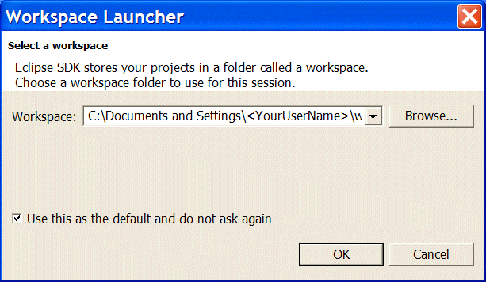
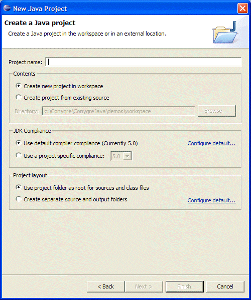
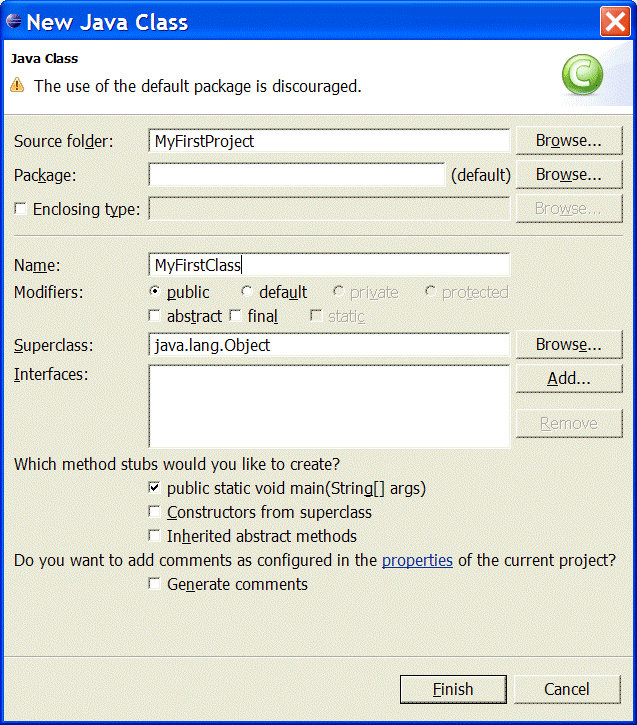

### Chapter 2 Working with Eclipse
You will begin by creating a basic Java project using Eclipse. This will familiarize you with the Eclipse Java development environment.
1.	From the desktop shortcut launch Eclipse.
2.	At the **Workspace Launcher** dialog, make a mental note of your default **workspace location**, then select, "Use this as the default and do not ask again". Then click **OK**. 

3.	Close the **Elicpse** welcome screen that appears.

4.	Click File, then click New, and then click **Project**.
5.	At the New dialog, expand the Java folder, and then select Java Project.

Figure 2 Creating a Java Project using Eclipse

6.	At the New Java Project dialog, enter the name MyFirstProject, and then click Finish.
7.	If prompted to switch to the Java perspective, select Yes.

You will now create a Java class within this project, and run it from Eclipse.

1.	From the File menu, point to New, and then click Class.
2.	In the New Class dialog, set the Name to be MyFirstClass, and in the “Which methods would you like to create?” section, select public static void main(String[] args). Then click Finish.
 
Figure 3 Creating a basic Java Class using Eclipse

3.	Within the curly braces of the main method, type System, enter the full stop (period) character, and then watch what happens. A drop down list of all of the method options appears below. You will find this very helpful as we progress through the course. 

 
Figure 4 Using Eclipse Intellisense

4.	From the intellisense drop down, select out, and then add a further full stop (period), and then you will get a further drop down for the methods and properties of out. Either select or type println, and then in the brackets add some text in double quotes. Don’t forget the semicolon from the end of the line! Your final statement should read:

System.out.println(“Hello from my application”);

5.	Eclipse will compile your code automatically, so you can now run it. To run the application, from the Run menu, click Run As, and then click Run as Application. If you are prompted to save any resources, click OK.
6.	The output from the application will appear in the console at the base of the screen.
7.	Finally, deliberately introduce an error into the application code, and see what happens when you try to run it. Note that tasks appear in the task list. Try clicking on a task. Note that it takes you straight to the line with the error.

You can now if you wish use Eclipse for the remaining exercises. Each exercise can be done in your existing project unless the exercise recommends a new project.
6.	At the **New Java Project dialog**, enter the name MyFirstProject, and then click Finish.
7.	If prompted to switch to the Java perspective, select Yes.

You will now create a Java class within this project, and run it from **Eclipse**.

1.	From the File menu, point to New, and then click Class.
2.	In the New Class dialog, set the Name to be MyFirstClass, and in the “Which methods would you like to create?” section, select public static void main(String[] args). Then click Finish.

 Figure 3 Creating a basic Java Class using Eclipse

3.	Within the curly braces of the main method, type System, enter the full stop (period) character, and then watch what happens. A drop down list of all of the method options appears below. You will find this very helpful as we progress through the course. 
 
Figure 4 Using Eclipse Intellisense

4.	From the intellisense drop down, select out, and then add a further full stop (period), and then you will get a further drop down for the methods and properties of out. Either select or type println, and then in the brackets add some text in double quotes. Don’t forget the semicolon from the end of the line! Your final statement should read:

System.out.println(“Hello from my application”);

5.	Eclipse will compile your code automatically, so you can now run it. To run the application, from the Run menu, click **Run** As, and then click Run as Application. If you are prompted to save any resources, click **OK**.
6.	The output from the application will appear in the console at the base of the screen.
7.	Finally, deliberately introduce an error into the application code, and see what happens when you try to run it. Note that tasks appear in the task list. Try clicking on a task. Note that it takes you straight to the line with the error.

You can now if you wish use Eclipse for the remaining exercises. Each exercise can be done in your existing project unless the exercise recommends a new project.

 

